## 即刻餐饮✨

 

*Chinzicam*

爆肝了好几天，终于做的差不多了，人都要写晕了

~~项目优化方面暂时搁置，先找到实习先🤣~~

写的时候的我尽量注释写的很全，方便以后复习与项目优化 ~(￣▽￣)~*️

------

### 项目描述

本项目是专门为餐饮企业定制的一款软件产品,包括系统管理后台和移动端应用两部分。

其中系统管理后台主要提供给餐饮企业内部员工使用,可以对餐厅的分类、菜品、套餐、订单、员工等进行管理维护。

用户端主要提供给消费者使用,使用QQ邮箱获取验证码进行登录，可以在线浏览菜品、更改收货地址、添加购物车、下单等。

### 技术架构

Spring，Springboot，MybatisPlus，MySQL

### 项目运行

> 首先下载本项目，运行resource路径下的**sql文件**

> 修改yml文件的**数据库配置**

至此，应该可以运行了。

---

> 另外utils包下的MailUtils类为qq邮箱验证码类，在用户端登录时使用，**建议修改为自己的邮箱和16位STMP授权码**

[如何获取qq邮箱授权码](https://markdown.com.cn "获取qq邮箱授权码")

---

### 数据库设计

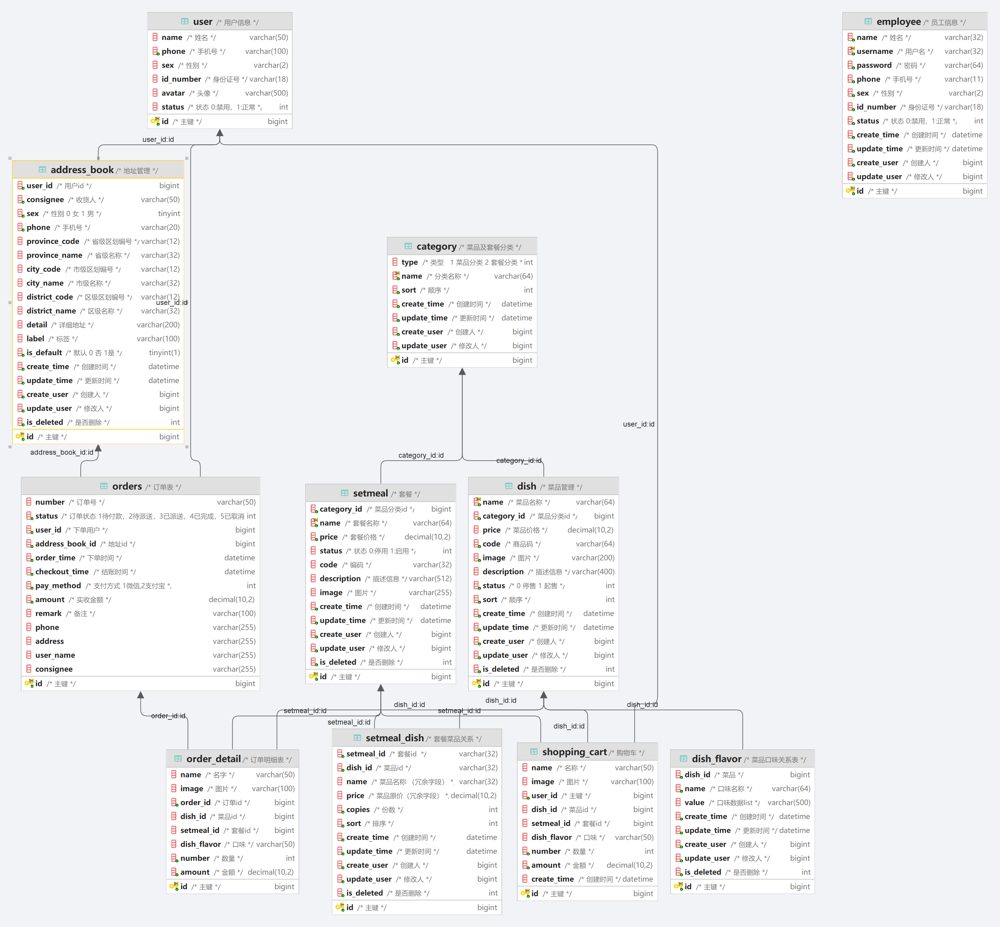

### 项目截图

#### 系统管理后台

##### 登录页

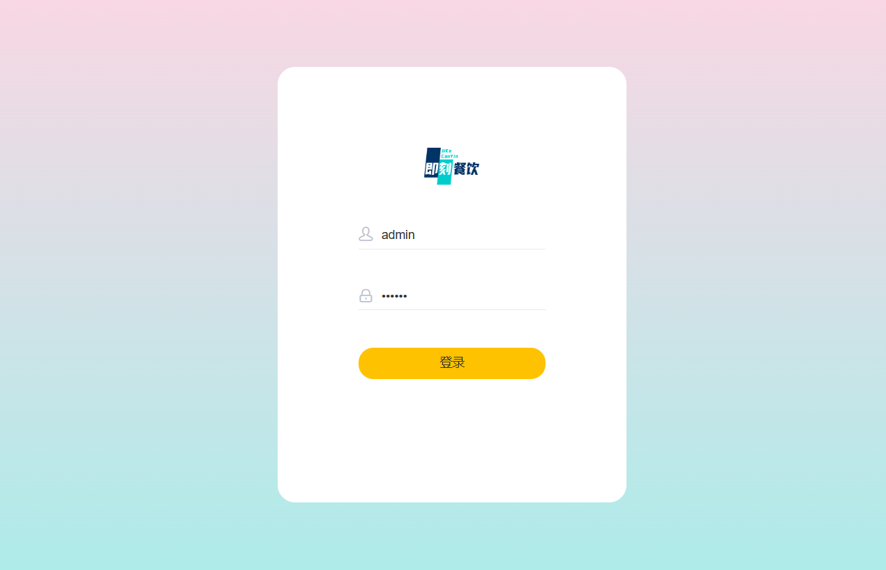

##### 员工管理

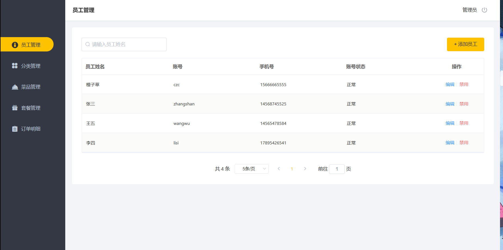

##### 分类管理

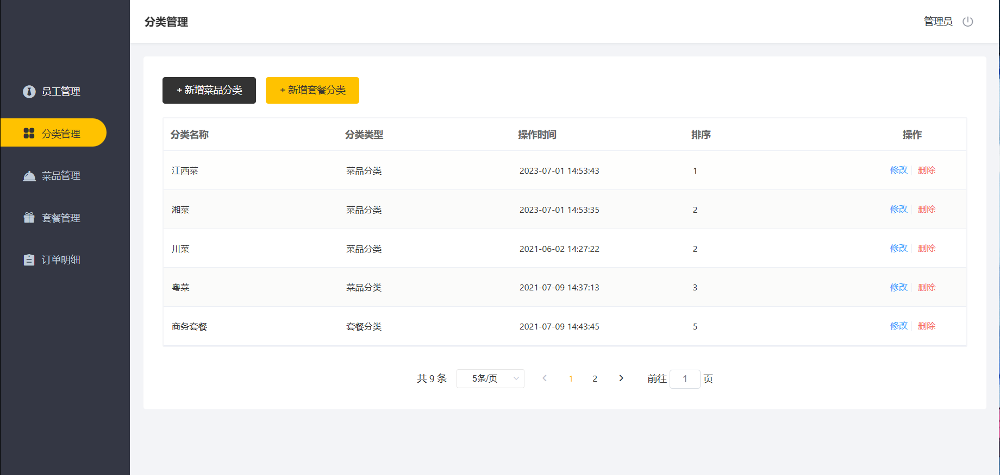

##### 菜品管理

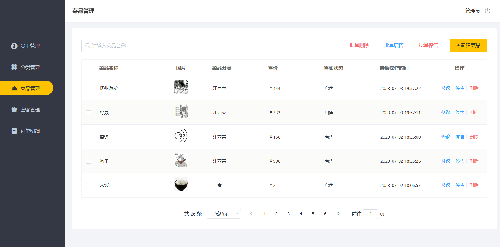

##### 套餐管理

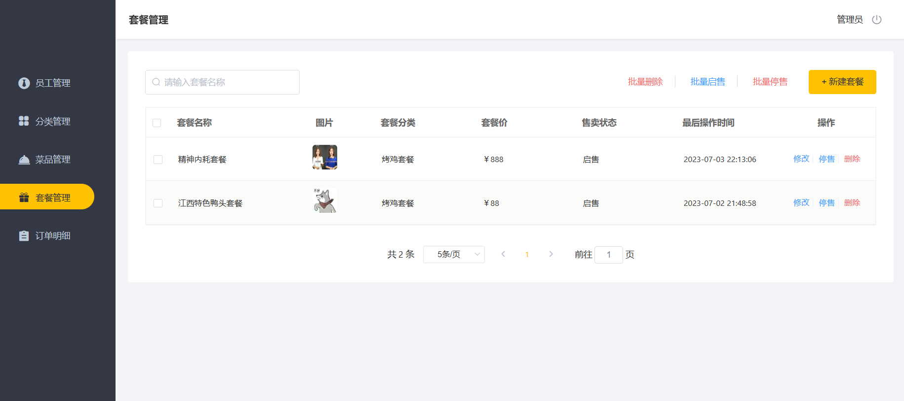

##### 订单管理

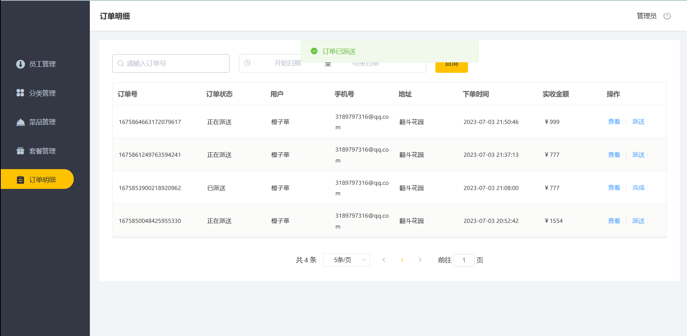

#### 用户端

##### 登录页

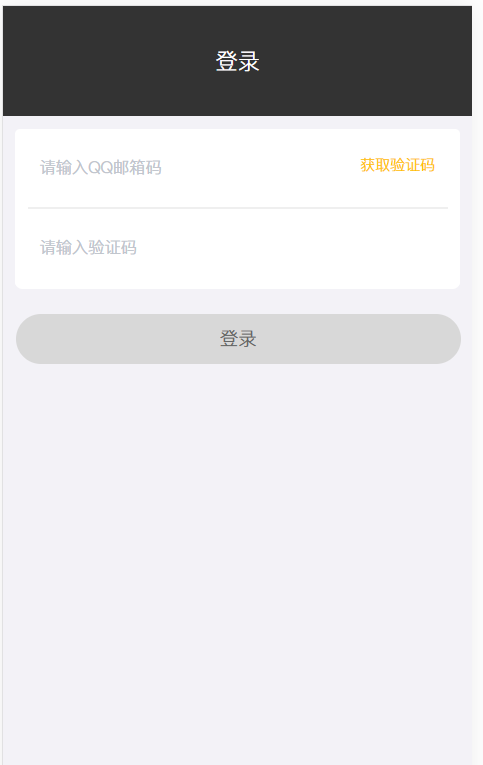

##### 购物车页

###### 首页

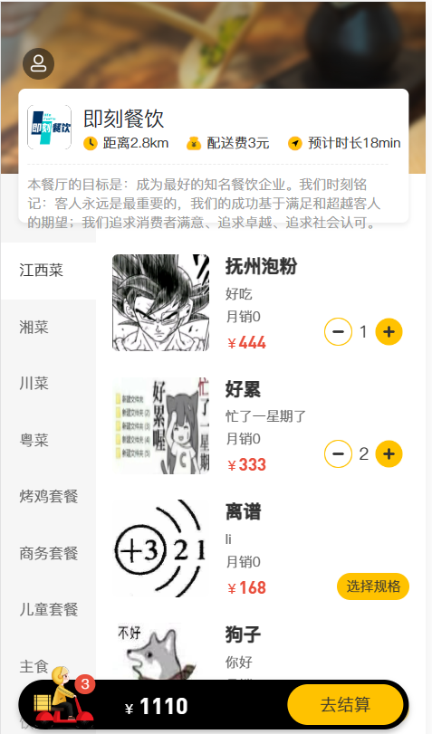

###### 购物车

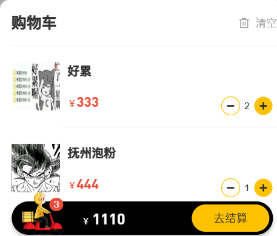

###### 点击图片放大

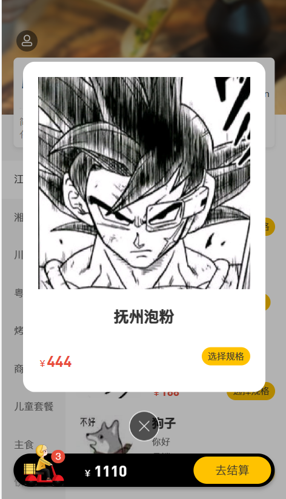

##### 个人中心

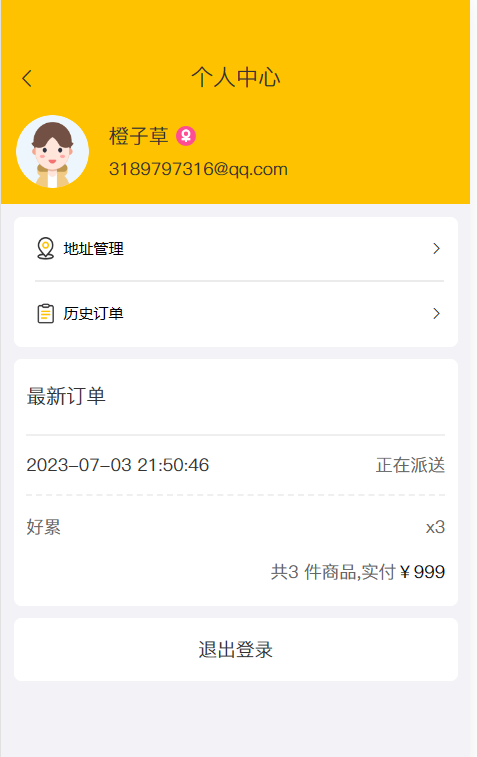

##### 地址管理

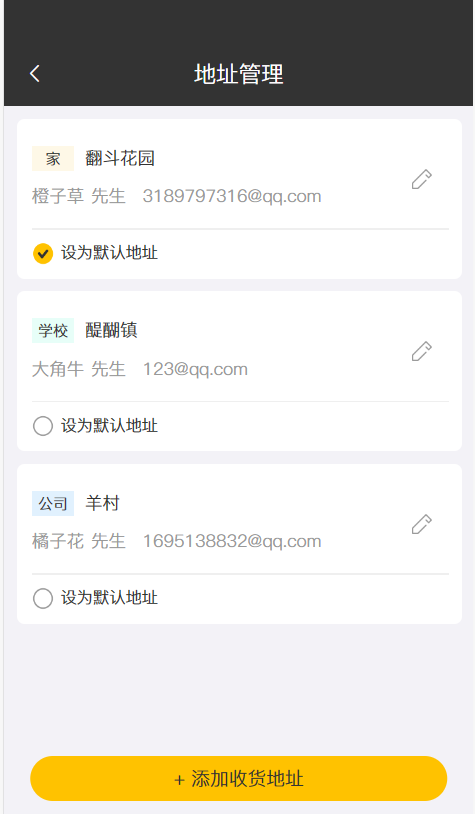

##### 历史订单

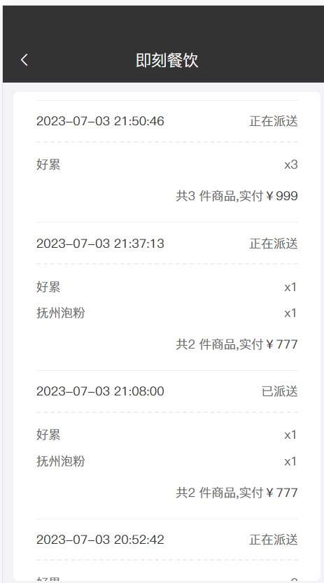

